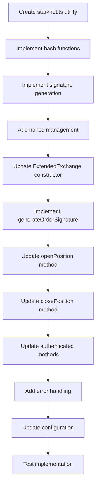

# Starknet Signature Implementation Plan for Extended DEX

## Overview

Implementation of Starknet ECDSA signature functionality for order management on Extended DEX using `@noble/curves` library.

## Architecture

### 1. Configuration Parameters

The following parameters are available from configuration:

- `stark-key-private`: Private key for signing (hex format)
- `stark-key-public`: Public key (hex format)
- `vault`: Vault identifier for collateral position
- `client-id`: Client identifier for the account
- `apiKey`: API key for authentication

### 2. Signature Components

#### 2.1 Starknet Curve

- **Curve**: Starknet uses a custom STARK-friendly elliptic curve
- **Library**: `@noble/curves/abstract/weierstrass` for ECDSA operations
- **Key Format**: Hexadecimal strings (with or without '0x' prefix)

#### 2.2 Message Structure

For order signing, the message typically includes:

```typescript
{
  id: string,           // Client order ID
  market: string,       // Market symbol (e.g., "BTC-USD")
  type: string,         // Order type ("market" or "limit")
  side: string,         // "buy" or "sell"
  qty: number,          // Order quantity
  price: number,        // Order price
  timeInForce: string,  // Time in force ("GTT", "GTC", etc.)
  expiryEpochMillis: number,  // Expiry timestamp
  fee: string,          // Fee amount
  nonce: string,        // Unique nonce for order
  vault: string,        // Vault ID
  clientId: string      // Client ID
}
```

#### 2.3 Signature Format

```typescript
{
  signature: {
    r: string,  // R component (hex)
    s: string   // S component (hex)
  },
  starkKey: string,           // Public key
  collateralPosition: string  // Vault/collateral position
}
```

### 3. Implementation Strategy

#### 3.1 Utility Functions (New File: `src/utils/starknet.ts`)

```typescript
// Core functions to implement:
1. normalizeHex(hex: string): string
   - Remove '0x' prefix if present
   - Ensure proper padding

2. hashOrderMessage(orderData: OrderMessage): string
   - Create deterministic hash of order parameters
   - Use Pedersen hash or Poseidon hash (Starknet standard)

3. signMessage(messageHash: string, privateKey: string): { r: string, s: string }
   - Sign using ECDSA with Starknet curve
   - Return signature components

4. generateNonce(): string
   - Timestamp-based nonce generation
   - Ensures uniqueness per order
```

#### 3.2 ExtendedExchange Modifications

**Constructor Enhancement:**

```typescript
constructor() {
  super("extended");

  // Initialize Starknet signing capability
  this.initializeStarknetSigning();

  // Add request interceptor for authenticated endpoints
  this.client.interceptors.request.use(this.signRequest.bind(this));
}
```

**Private Methods to Add:**

```typescript
1. initializeStarknetSigning(): void
   - Validate configuration parameters
   - Load and validate private key
   - Prepare signing infrastructure

2. signRequest(config: AxiosRequestConfig): AxiosRequestConfig
   - Intercept requests to private endpoints
   - Add authentication headers if needed

3. generateOrderSignature(orderData: OrderData): SettlementSignature
   - Create message hash from order parameters
   - Sign with private key
   - Return signature object

4. validateSignatureConfig(): void
   - Ensure all required config parameters exist
   - Validate key formats
```

**Method Updates:**

```typescript
1. openPosition(order: OrderData): Promise<string>
   - Generate dynamic nonce
   - Create order message
   - Generate signature using private key
   - Include vault and clientId from config
   - Send signed order to API

2. closePosition(positionId: string): Promise<boolean>
   - Generate signature for close request
   - Include authentication

3. getAccountBalance(): Promise<{ [token: string]: number }>
   - Add signature authentication
   - Remove warning about missing auth

4. getAllPositions(): Promise<any[]>
   - Add signature authentication

5. getOrderHistory(): Promise<any[]>
   - Add signature authentication
```

### 4. Nonce Management Strategy

**Approach: Timestamp-based with microsecond precision**

```typescript
generateNonce(): string {
  const timestamp = Date.now();
  const microseconds = process.hrtime.bigint();
  return `${timestamp}${microseconds % 1000n}`;
}
```

**Benefits:**

- Guaranteed uniqueness per order
- No need for persistent storage
- Simple and reliable
- Chronologically ordered

### 5. Error Handling

**Error Categories:**

```typescript
1. Configuration Errors
   - Missing private key
   - Invalid key format
   - Missing vault/clientId

2. Signature Errors
   - Signing failure
   - Invalid signature format
   - Key mismatch

3. API Errors
   - Signature rejected by server
   - Invalid order parameters
   - Authentication failure
```

**Implementation:**

```typescript
class StarknetSignatureError extends Error {
  constructor(
    message: string,
    public code: string,
  ) {
    super(message);
    this.name = "StarknetSignatureError";
  }
}

// Usage in methods:
try {
  const signature = this.generateOrderSignature(orderData);
} catch (error) {
  if (error instanceof StarknetSignatureError) {
    console.error(`Signature error [${error.code}]:`, error.message);
  }
  throw new Error("Failed to generate order signature");
}
```

### 6. Configuration Updates

**Update `config/default.json`:**

```json
{
  "extended": {
    "enabled": true,
    "fundingFrequency": 1,
    "baseUrl": "https://api.starknet.extended.exchange",
    "webSocketURL": "wss://api.starknet.extended.exchange/ws",
    "stark-key-public": "your-public-key",
    "stark-key-private": "your-private-key",
    "vault": "your-vault-id",
    "client-id": "your-client-id",
    "apiKey": "your-api-key"
  }
}
```

### 7. Dependencies

**Required packages (already in package.json):**

- `@noble/curves`: ^2.0.1 ✓
- `@noble/hashes`: ^2.0.1 ✓

**Additional imports needed:**

```typescript
import { weierstrass } from "@noble/curves/abstract/weierstrass";
import { Field } from "@noble/curves/abstract/modular";
import { sha256 } from "@noble/hashes/sha256";
import { keccak_256 } from "@noble/hashes/sha3";
```

### 8. Testing Strategy

**Unit Tests:**

1. Signature generation with known inputs
2. Nonce uniqueness verification
3. Message hashing consistency
4. Key validation

**Integration Tests:**

1. Order placement with signature
2. Position closing with authentication
3. Balance retrieval with authentication
4. Error handling scenarios

### 9. Security Considerations

1. **Private Key Storage:**
   - Never log private keys
   - Use environment variables for production
   - Validate key format on initialization

2. **Signature Validation:**
   - Verify signature components before sending
   - Ensure nonce uniqueness
   - Validate message hash format

3. **Error Messages:**
   - Don't expose sensitive information in errors
   - Log detailed errors internally only
   - Return generic errors to users

### 10. Implementation Sequence



### 11. Code Structure

```
src/
├── utils/
│   └── starknet.ts          # New: Starknet utilities
├── services/
│   └── exchanges/
│       └── ExtendedExchange.ts  # Modified: Add signature support
└── config/
    └── default.json         # Modified: Add Starknet config
```

### 12. Success Criteria

- ✓ Signature generation works with provided keys
- ✓ Orders are successfully placed with valid signatures
- ✓ Authenticated endpoints return data
- ✓ Error handling covers all failure scenarios
- ✓ Configuration validation prevents invalid setups
- ✓ No hardcoded credentials in code

## Next Steps

1. Create `src/utils/starknet.ts` with signature utilities
2. Implement signature generation in `ExtendedExchange.ts`
3. Update configuration files
4. Test with real API calls
5. Document usage for other developers

## References

- Starknet Documentation: https://docs.starknet.io
- @noble/curves: https://github.com/paulmillr/noble-curves
- Extended DEX API: https://api.starknet.extended.exchange/docs
